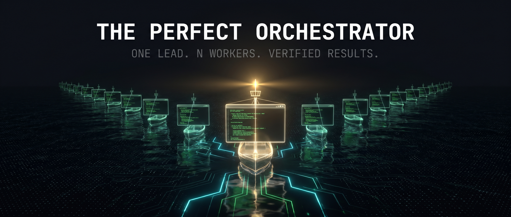
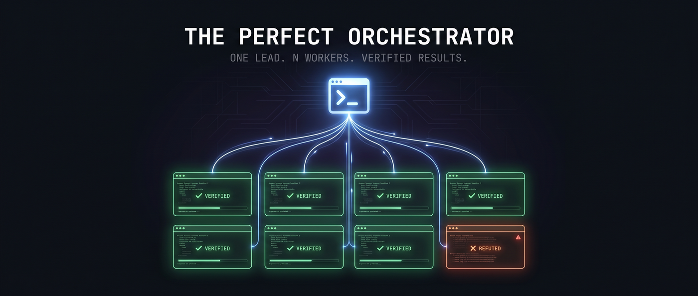
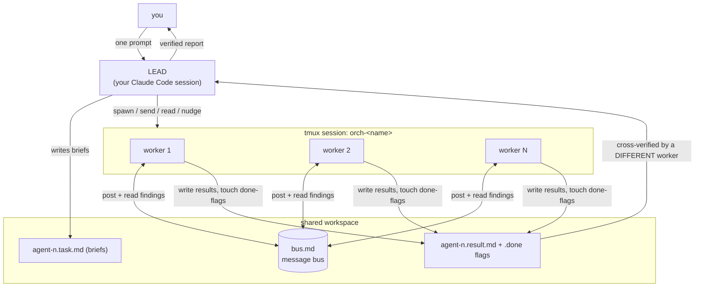

<p align="center">
  
</p>

<p align="center"><i>No orchestrator is perfect — this one just refuses to trust its own workers.</i></p>

<p align="center"><b><a href="https://the-perfect-orchestrator.vercel.app">the-perfect-orchestrator.vercel.app</a></b> — the site (built and QA'd by its own fleet)</p>

<p align="center">
  <a href="LICENSE"></a>
  
  
  <a href="https://github.com/daman8271/the-perfect-orchestrator/actions"></a>
  
  <a href="https://the-perfect-orchestrator.vercel.app"></a>
</p>

---

You talk to **one** Claude Code session — the **LEAD**. It spawns N fully interactive
Claude Code workers in tmux panes, writes each a task brief, watches their screens,
nudges the ones that drift, lets them coordinate through a shared message bus — and
then **has the workers adversarially verify each other's results before reporting
anything back to you**.

```
┌─ tmux: orch-audit ───────────────────────────────────────────────┐
│ ┌─ W1: scanning auth/ ──────────┐ ┌─ W2: scanning api/ ────────┐ │
│ │ ✻ Found unsafe redirect in    │ │ ✻ 3 endpoints missing rate │ │
│ │   login_v2.js:114 → bus.md    │ │   limits → bus.md          │ │
│ └───────────────────────────────┘ └────────────────────────────┘ │
│ ┌─ W3: scanning jobs/ ──────────┐ ┌─ W4: VERIFIER ─────────────┐ │
│ │ ✻ cron job runs as root,      │ │ ✻ Re-checked W1's finding: │ │
│ │   writing world-readable tmp  │ │   CONFIRMED. W2's #2 is a  │ │
│ └───────────────────────────────┘ │   FALSE POSITIVE — rejected│ │
│                                   └────────────────────────────┘ │
└──────────────────────────────────────────────────────────────────┘
        ▲ the LEAD (your session) reads panes, nudges, collects
```

## Why this exists

Anyone who has run multi-agent setups knows the real problem isn't spawning agents —
it's that **workers lie**. They rubber-stamp, declare victory early, and hallucinate
"done". Most orchestration harnesses trust worker output blindly.

This one is built around a different rule, learned in production:
**findings don't count until a *different* worker has tried to tear them apart.**
In real use this has repeatedly caught not just worker mistakes — but the lead's own
wrong assumptions.

## How it works

<p align="center">
  
</p>



Every worker is a **full interactive Claude Code session** — its own context window,
its own tools, its own TUI you can watch live. Coordination is **plain files**: no
servers, no daemons, no message broker. The lead is **alive** — it monitors, corrects,
and re-plans mid-flight; it isn't a cron job poking a prompt.

### The worker protocol

Each worker is told: *you are Worker n of N; your task is in `agent-<n>.task.md`;
coordinate via `bus.md` (append lines prefixed `[Wn]`, read it to see peers); when
finished write `agent-<n>.result.md` then `touch agent-<n>.done`; work autonomously,
never wait.*

## Quickstart

```bash
git clone https://github.com/daman8271/the-perfect-orchestrator
cd the-perfect-orchestrator
./install.sh        # installs the `orch` CLI + the /orch Claude Code skill
orch doctor         # verify setup + get the allow-rules for your lead session
```

Then open Claude Code in any project and type:

```
/orch audit this codebase for security issues with 4 workers and verify every finding
```

Your session becomes the lead and runs the whole spawn → brief → monitor → verify →
report loop. Or drive it by hand:

```bash
orch spawn audit 4 ~/my-project      # 4 workers in tmux session orch-audit
orch send  audit 1 --file ~/.orch/runs/audit/shared/agent-1.task.md
orch read  audit 1                   # watch worker 1's screen
orch status audit                    # panes + done-flags + bus tail
orch kill  audit                     # tear down
```

## Commands

| command | what it does |
|---|---|
| `orch spawn <session> <N> [workdir]` | tmux session `orch-<session>` with N tiled worker panes + a shared workspace (`bus.md` + pane map at spawn; briefs, results, and done-flags land there as the fleet works) |
| `orch send <session> <n> <msg>` | type a single-line prompt into worker *n* (newline submits — use `--file` for briefs) |
| `orch send <session> <n> --file <path>` | point worker *n* at a task-brief file |
| `orch read <session> <n> [lines]` | capture worker *n*'s pane — see what it's doing, catch stalls |
| `orch status [session]` | list fleets, or one fleet's panes + done-flags + bus tail |
| `orch kill <session> \| --all` | tear down |
| `orch doctor` | dependency check + the allow-rules your lead needs |

## Battle-tested patterns

These came from running real production work through fleets — not demos.
Full playbook: [docs/PATTERNS.md](docs/PATTERNS.md).

- **Find → verify.** Some workers FIND, a *different* worker VERIFIES each finding.
  Independent eyes kill false positives.
- **Brief neutrally.** Ask a worker to *"verify whether X is wrong"*, never *"fix the
  X bug"* — pre-declaring the cause makes workers rubber-stamp your assumption.
  (This has repeatedly caught the lead itself being wrong.)
- **One owner per shared file.** Parallel edits to one file = collided commits. One
  owner; everyone else requests changes via the bus.
- **Commit-local, lead pushes.** Workers commit only their own files behind a lock;
  the lead verifies each commit (`git show --stat`) before anything is pushed.
- **3× cross-verify for high stakes.** R1 audits → R2 adversarially refutes R1 →
  R3 confirms the survivors.

## How it compares

A multi-agent, source-verified survey of every public Claude-fleet orchestrator we
could find (snapshot 2026-06-05, full report: [docs/LANDSCAPE.md](docs/LANDSCAPE.md)):

| | The Perfect Orchestrator | [Tmux-Orchestrator](https://github.com/Jedward23/Tmux-Orchestrator) | [claude-squad](https://github.com/smtg-ai/claude-squad) | [claude-tmux-orchestration](https://github.com/primeline-ai/claude-tmux-orchestration) | Claude Code Agent Teams |
|---|:---:|:---:|:---:|:---:|:---:|
| Lead is a live Claude session | ✅ | ✅ | ❌ human-driven TUI | ⚠️ external bash heartbeat | ✅ |
| Interactive TUI workers (watch them live) | ✅ | ✅ | ✅ | ✅ | ⚠️ optional |
| File-based message bus | ✅ `bus.md` | ❌ send-keys only | ❌ | ✅ JSON files | ⚠️ mailbox (pushed) |
| Per-worker task brief files | ✅ | ❌ | ❌ | ⚠️ injected prompts | ✅ task list |
| Done-flag completion | ✅ | ❌ poll panes | ❌ | ✅ | ✅ |
| **Adversarial verification of results** | ✅ **core design** | ❌ | ❌ | ❌ | ⚠️ debate-during-investigation only |
| Status (2026-06) | active | dormant since 2025-07 | active (human multiplexer) | active | experimental, env-flagged |

## Security model — read this

Workers run with `defaultMode: auto` and a **generous allowlist**
([config/worker-settings.json](config/worker-settings.json)): git, node, python,
file edits, network fetches. That is what makes them autonomous — and it is real
power. Deliberate choices:

- `rm` is **not** allowlisted — destructive deletes still hit the permission
  classifier instead of running blind.
- Workers share your existing Claude credentials (symlink) but get an **isolated
  config dir** — your hooks, history, and settings are untouched.
- **Run fleets on a VPS or in a container**, in repos you can `git reset`. Don't
  point a 6-worker fleet at the only copy of anything.

Tighten or loosen `~/.orch/worker-config/settings.json` to taste. See
[SECURITY.md](SECURITY.md).

## Requirements

- Linux or macOS, `tmux` ≥ 3.0
- [Claude Code](https://claude.com/claude-code) CLI, logged in
- A Claude plan that tolerates N parallel sessions (workers are real sessions and
  consume real usage — size fleets to the work)

## Roadmap

- [ ] `orch verify` — first-class verification pass: auto-spawn refuters for every
      done-flag, emit a **Verification Matrix** (claim × verifier × verdict)
- [ ] `orch demo` — 3-worker self-verifying demo on any repo, < 2 minutes
- [ ] `orch watch` — clean read-only mosaic view built for screen-recording
- [ ] Per-worker token/cost telemetry on the status line
- [ ] Role brief templates (finder / fixer / verifier / scribe)
- [ ] Compatibility layer for Claude Code's experimental Agent Teams primitives

## FAQ

**Why tmux and not the SDK / headless mode?**
Headless agents are invisible. Interactive workers give you (and the lead) a live
screen per worker — you can *watch* worker 3 go down a rabbit hole and yank it back.
Observability is the feature.

**Won't this burn tokens?**
Yes — fleets trade tokens for wall-clock time and coverage. Size the fleet to the
work (see [docs/PATTERNS.md](docs/PATTERNS.md)); use it for genuinely parallel,
long-running jobs, not one-file fixes.

**What stops two workers from stepping on each other?**
The bus, the briefs, and ownership rules: one owner per shared file, lock-guarded
commits, lead-only pushes.

## License

[MIT](LICENSE) © 2026 danny ([daman8271](https://github.com/daman8271))

---

<p align="center"><i>Built — and battle-tested — by orchestrating the very fleets it now ships.</i></p>
